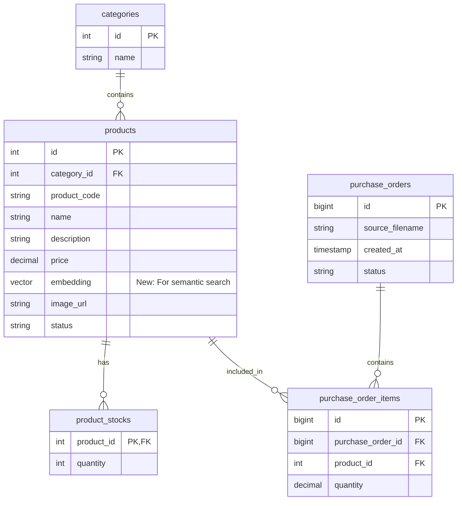

# 要件定義書

## 1. プロジェクト概要

### 1.1 プロジェクト名
発注管理システム MVP (OCR機能付き)

### 1.2 目的
歯科医院等の発注業務を効率化するため、過去の発注書画像をOCR解析し、商品名から類似商品を検索・提案することで、発注の手間を削減するシステムを構築する。

### 1.3 コア機能
*   **商品画像検索 (OCR + ベクトル検索)**: 発注書画像からテキストを抽出し、意味的に近い商品をデータベースから検索して提案する。
*   **商品管理**: 商品の登録、編集、一覧表示。
*   **発注管理**: カート機能、発注の確定、過去の発注履歴の確認。

## 2. 機能要件

### 2.1 ページ構成
1.  **商品一覧ページ (TOP)**
    *   全商品の一覧表示（ページネーション/無限スクロール）。
    *   **カートポップアップ**: 選択した商品の確認、数量変更、削除、発注確定。
    *   **画像検索OCRポップアップ**:
        *   画像アップロード。
        *   OCR処理実行 (Gemini 3.0 Flash API)。
        *   解析結果と類似商品候補の表示。
        *   候補から商品を選択し、数量を指定してカートへ追加。
    *   通常キーワード検索、カテゴリフィルタ。

2.  **発注済み一覧ページ**
    *   過去の発注履歴リスト表示（日付、ステータス等）。
    *   **発注明細ページ**: 選択した発注の详细商品リストを表示。

3.  **商品登録ページ**
    *   新規商品の入力フォーム（商品名、コード、価格、説明、画像URL等）。
    *   カテゴリ選択（新規カテゴリ追加へのリンク）。

4.  **商品カテゴリ登録ページ**
    *   商品登録ページから遷移可能。
    *   新規カテゴリの追加。

### 2.2 OCR・検索フロー
1.  ユーザーが発注書画像をアップロード。
2.  バックエンド経由でGemini 3.0 Flash APIに画像を送信し、商品名・数量などの構造化データを取得。
3.  抽出された商品名に対し、DB内で**ハイブリッド検索**を実行。
    *   **キーワード検索**: `pg_trgm` を利用した類似文字列検索。
    *   **ベクトル検索**: 商品名・説明文の埋め込みベクトルを用いた意味的検索 (pgvector)。
4.  検索結果（候補商品）をUIに表示。
    *   確度が高いものは「候補」、関連性が高いものは「おすすめ」として提示。
5.  ユーザーが正しい商品を選択・補正し、カートに追加。

### 2.3 データ管理要件
*   **商品データ**: 商品情報に加え、検索用のベクトルデータを保持する。
*   **カテゴリデータ**: 商品を分類するためのカテゴリを管理する。
*   **発注データ**: 確定した発注情報と明細を永続化する。OCRの一時データはDBに保存せず、確定データのみを保存する。

## 3. データベース設計

### 3.1 既存DBの評価と変更点
現在の `db/` ディレクトリ内のSQLファイルを確認した結果、以下の修正・追加が必要である。

#### 必要な変更
1.  **`products` テーブルへの変更**:
    *   `category_id` カラムの追加（`categories`テーブルへの外部キー）。
    *   `embedding` カラムの追加（`pgvector`用）。型は `vector(768)` (Gemini embeddingモデルの次元数に合わせる、要確認)。※Gemini text-embedding-004は768次元。
2.  **`categories` テーブルの新規作成**:
    *   `id`, `name`, `created_at`, `updated_at` を持つシンプルなマスタ。
3.  **拡張機能**:
    *   `vector` 拡張機能の有効化 (`01-init.sql` に追加)。

#### 不要なもの / 修正が必要なファイル
*   `02-tables-minilm.sql`: ファイル名は具体的すぎるため `02-tables-products.sql` 等に変更推奨。内容に `categories` テーブル作成と `products` へのカラム追加を反映させる必要がある。
*   `03-indexes.sql`: ベクトル検索用のIVFFlatまたはHNSWインデックスを追加する必要がある。

### 3.2 ER図（概念）

## 4. 非機能要件
*   **レスポンス速度**: OCR処理は外部API依存だが、DB検索はインデックスを活用し高速に行う。
*   **拡張性**: 将来的に商品数が増えても検索速度が維持できるよう、適切なインデックス戦略（HNSW等）を採用する。
*   **UI/UX**: カート操作やOCR結果の確認がスムーズに行えるモーダルUIを採用する。

## 5. 技術スタック (想定)
*   **Frontend**: React (Next.js推奨), TypeScript, Tailwind CSS
*   **Backend**: Python (FastAPI) or Node.js (Next.js API Routes), LangChain (for OCR/Embedding flow)
*   **Database**: PostgreSQL 16 + pgvector
*   **AI**: Google Gemini 3.0 Flash (OCR), Gemini Embeddings (Vector Search)
*   **Container**: Docker, Docker Compose

